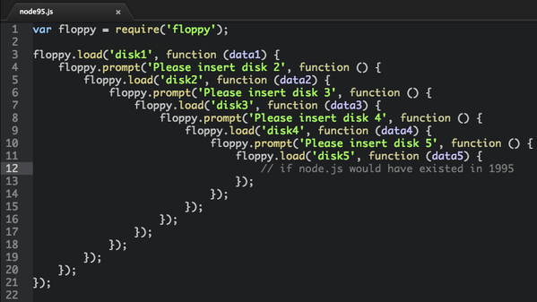
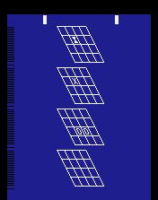

= Clojurescript Tic-Tac-Toe
Patrik Duditš, @pdudits
:revealjs_history: true
:revealjs_transition: fade
:source-highlighter: coderay

:on-lisp: http://www.paulgraham.com/onlisp.html
:sicp: http://mitpress.mit.edu/sicp/

:lein: http://leiningen.org/
:clojuredocs: https://clojuredocs.org/
:crossclj: http://crossclj.info/
:toolbox: http://www.clojure-toolbox.com/

== Me and LISP

* Java EE architect
* Therefore just theory:
** {sicp}[Strucure and Interpretation of Computer Programs]
** {on-lisp}[On LISP]
** Joy of Clojure

== LightTable
* http://lighttable.com[An IDE with live evaluation]
* Completely written in ClojureScript on top of node-webkit
* Crowdfunded (remarkably successful tech kickstarter project)

== But, the parens!

== (1 + 2)

== (+ 1 2)

== System.exit(0)

== (System/exit 0)

== There's more syntax in Clojure

* Lists ``'(1 2 3)``
* Vectors ``[1 2 3]``
* Maps ``{:key "value"}``
* Destructuring constructs
* More to come in live-coding

== Crash course

[source, clojure]
----
; call function map with inline function (lambda) and a vector
(map (fn [n] (* n 2)) [1 2 3 4 5]) ;=> [2 4 6 8 10]
; shorthand
(map #(* % 2) [1 2 3 4 5]) ;=> [2 4 6 8 10]
; define a function
(defn times-2 [x] (map #(* % 2) x)) ;=>user/times-2
; define overloaded function
(defn times-2
  "Multiply a collection by 2. If not supplied use predefined one"
  [] (times-2 [1 2 3 4 5])
  [x] (map #(* % 2) x)) ;=> user/times-2
----

== Vectors and Maps
[source, clojure]
----
(def vector [1 2 3 4 5]) ; => [1 2 3 4 5]
(count vector) ;=> 5
(conj vector 6) ; conjoin => [1 2 3 4 5 6]
(assoc vector 3 8) ;=> [1 2 3 8 5]
(nth vector 1) ; => 2
(get vector 5 :none) ; => :none
(vector 3) ; => 4

(def a-map {:foo "bar" :doo "var"}) ;=> {:foo "bar" :doo "var"}
(count a-map) ;=> 2
(assoc a-map :bar "baz") ;=> {:foo "bar" :doo "var" :bar "baz"}
(get a-map :aaa :none) ;=> :none
(a-map :foo) ;=> "bar"
(:doo a-map) ;=> "var"
----

== Deep maps
[source, clojure]
----
(def a-nested-map {:customer-id 1e6
                   :preferences {:nickname "Bob"
                                 :avatar "/userimage/0/0.jpg"}
                   :services {:alerts {:daily true}}})

(get-in a-nested-map [:preferences :nickname]) ;=> "Bob"

; update by applying a function on the nested keys
(def other-map (update-in a-nested-map [:services :alerts] not))
(get-in a-nested-map [:services :alerts]) ;=> false

(:customer-id (assoc-in a-nested-map [:customer-id] 1039) ; => 1039
----

== Clojure Build infrastructure

* Used to be lots of Maven
* clojars.org repo
* {lein}[Leiningen]

== Clojure Documentation

* {clojuredocs}[ClojureDocs]
* {crossclj}[CrossClj.info]
* {toolbox}[Clojure Toolbox]

== ClojureScript

Clojure to Javascript compiler

== Pronounciation test

Compiling Clo__**j**__ure with Google Clo__**s**__ure compiler and utilizing both Clo__**j**__ure standard library and Google Clo__**s**__ure library.

[quote.fragment]
Java is to JavaScript what ham is to hamster

== Everybody loves to transpile!

* GWT
* CofeeScript
* Dart
* ES6
* TypeScript

== Everybody!!

* Scala.js
* Opal.js (Ruby)
* Elm (Haskell)

== So why Clojure to JS?
[.fragment]
full-stack development
[.fragment]
*core.async*

[.fragment.small]
Implementation of Communicating Sequential Processes

== If node existed in '95

== In ClojureScript

[source, clojure]
----
(ns demo
    (require [core.async :refer [go <!] :include-macros true]
             [floppy :refer [<load <prompt]]))

(go (let [data1 (<! (<load "disk1"))
          data2 (<! (<load "disk2" (<! (<propmt "insert disk 2"))))
          data3 (<! (<load "disk3" (<! (<propmt "insert disk 3"))))
          data4 (<! (<load "disk4" (<! (<propmt "insert disk 4"))))
          data5 (<! (<load "disk5" (<! (<propmt "insert disk 5"))))]
      (process)))
----

== Let's do 3D tic tac toe

* In ClojureScript
* With ReactJS components
* With Dynamic evaluation in IDE

== Create a new project

  lein new reagent tttoe-3d +test

