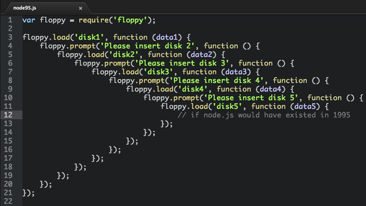

= Clojurescript Tic-Tac-Toe
Patrik Duditš, @pdudits
:revealjs_history: true
:revealjs_transition: fade
:source-highlighter: coderay

:on-lisp: http://www.paulgraham.com/onlisp.html
:sicp: http://mitpress.mit.edu/sicp/

:lein: http://leiningen.org/
:clojuredocs: https://clojuredocs.org/
:crossclj: http://crossclj.info/
:toolbox: http://www.clojure-toolbox.com/

== Me and LISP

* Java EE architect
* Therefore just theory:
** {sicp}[Strucure and Interpretation of Computer Programs]
** {on-lisp}[On LISP]
** Joy of Clojure

== LightTable
* http://lighttable.com[An IDE with live evaluation]
* Completely written in ClojureScript on top of node-webkit
* Very successfully crowdfunded ($300k for Clojure/Javascript IDE)

== But, the parens!

== (1 + 2)

== (+ 1 2)

== System.exit(0)

== (System/exit 0)

== There's more syntax in Clojure

* Lists ``'(1 2 3)``
* Vectors ``[1 2 3]``
* Maps ``{:key "value"}``
* Destructuring constructs
* More to come in live-coding

== Clojure Build infrastructure

* Used to be lots of Maven
* clojars.org repo
* {lein}[Leiningen]

== Clojure Documentation

* {clojuredocs}[ClojureDocs]
* {crossclj}[CrossClj.info]
* {toolbox}[Clojure Toolbox]

== ClojureScript

Clojure to Javascript compiler

== Pronounciation test

Compiling Clo__**j**__ure with Google Clo__**s**__ure compiler and utilizing both Clo__**j**__ure standard library and Google Clo__**s**__ure library.

[quote.fragment]
Java is to JavaScript what ham is to hamster

== Everybody loves to transpile!

* GWT
* CofeeScript
* Dart
* ES6
* TypeScript

== Everybody!!

* Scala.js
* Opal.js (Ruby)
* PureScript (Haskell)

== So why Clojure to JS?

[.fragment]
core.async

[.fragment]
Implementation of Communicating Sequential Processes (a. k. a. continuations)

== If node existed in '95

== In ClojureScript

[source, clojure]
----
(ns demo
    (require [core.async :refer [go <!]]
             [floppy :refer [<load <prompt]]))

(go (let [data1 (<! (<load "disk1"))
          data2 (<! (<load "disk2" (<! (<propmt "insert disk 2"))))
          data3 (<! (<load "disk3" (<! (<propmt "insert disk 3"))))
          data4 (<! (<load "disk4" (<! (<propmt "insert disk 4"))))
          data5 (<! (<load "disk5" (<! (<propmt "insert disk 5"))))]
      (process)))
----

== Let's do 3D tic tac toe

image::3-D_Tic-Tac-Toe_Atari_2600.png[float="left"]

* In ClojureScript
* With ReactJS components
* With Dynamic evaluation in IDE
